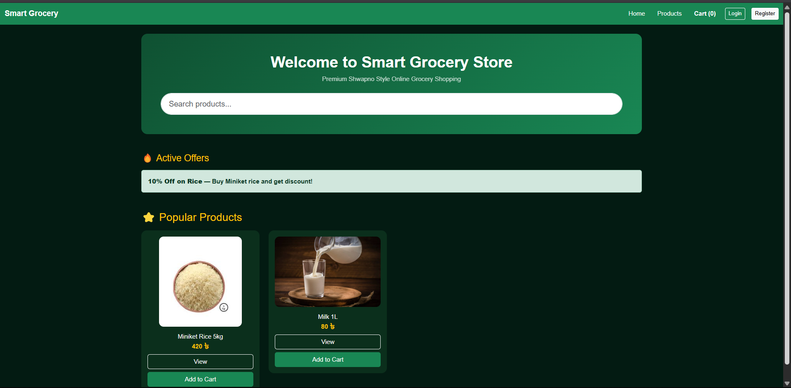
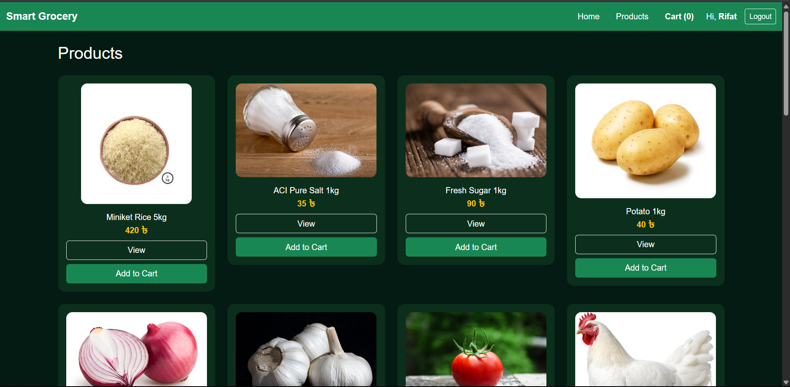
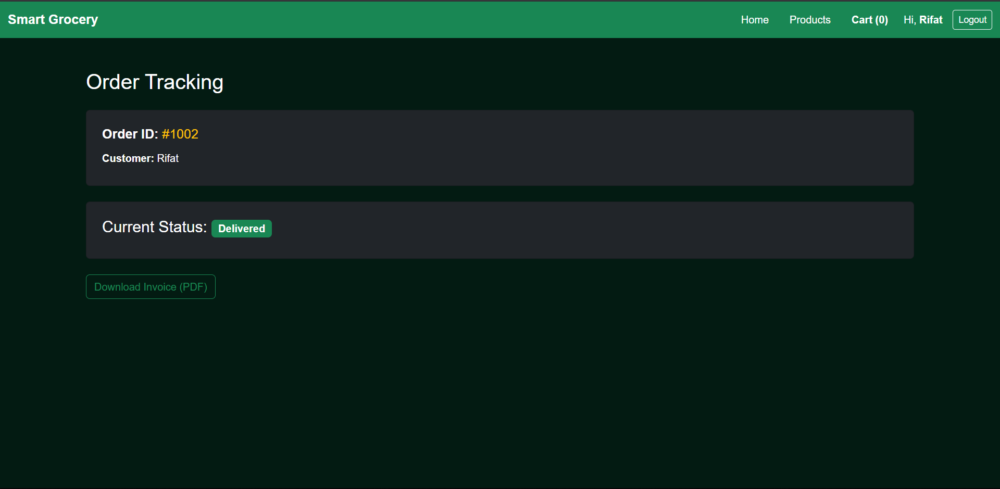
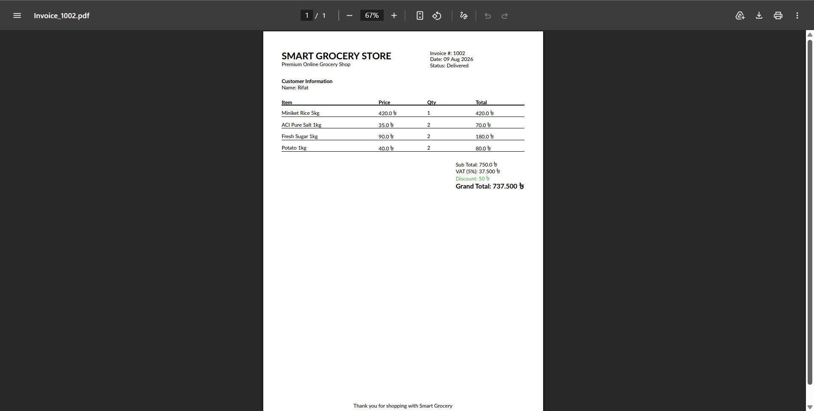
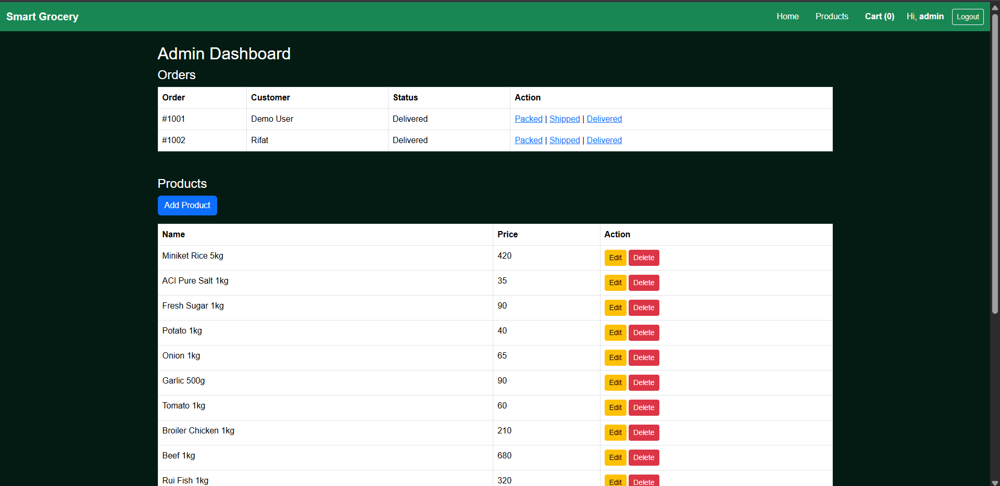

# 🛒 Smart Grocery Store Web App

> A robust, interactive, and full-featured online grocery shopping platform built with **C#** and **ASP.NET Core MVC**. 

Welcome to our collaborative group project! We built this application to bridge the gap between theoretical learning and real-world e-commerce logic. From dynamic cart management without page reloads to real-time order tracking and instant PDF invoice generation, this project simulates a complete shopping experience.

---

## ✨ Standout Features

* **⚡ AJAX-Powered Interactivity:** The shopping cart updates instantly. Add items, change quantities, and see price calculations on the fly without refreshing the page.

* **🛡️ Smart Inventory Validation:** Real-time stock checking ensures users can never order more items than what's currently available in the warehouse.

* **📦 Live Order Tracking:** Customers get a transparent view of their order journey with dynamic statuses: *Processing ➔ Packed ➔ Shipped ➔ Delivered*.

* **🧾 Automated PDF Invoices:** Integrated **QuestPDF** to instantly generate professional, downloadable receipts complete with VAT and dynamic discounts.

* **🔐 Admin Control Panel:** A secured dashboard allowing store managers to oversee operations, perform CRUD actions on inventory, handle image uploads, and manually push order statuses.

---

## 📸 Visual Walkthrough

Here is a quick tour of the application's core modules:

### 🏠 1. The Storefront (Homepage)
A clean, intuitive user interface where shoppers can easily browse active offers, popular items, and fresh groceries.

### 🛒 2. Dynamic Shopping Cart
An interactive cart that handles real-time stock validation, automated 5% VAT calculations, and conditional discounts.

### 🚚 3. Real-Time Order Tracking
A transparent tracking page allowing users to monitor their order's delivery progress step-by-step.

### 📄 4. Professional PDF Invoice
Instantly generated, print-ready PDF receipts for every completed order, providing a seamless post-purchase experience.

### ⚙️ 5. Admin Dashboard
The operational hub for store owners to manage product listings, track user orders, and update shipping phases securely.

---

## 🛠️ Tech Stack & Architecture

* **Backend Environment:** C#, ASP.NET Core MVC

* **Frontend Design:** HTML5, CSS3, JavaScript, AJAX

* **PDF Engine:** QuestPDF

* **Data Serialization:** Newtonsoft.Json

* **Data Storage:** In-memory Mock Database (`FakeDb`) using C# Collections (Designed for easy local testing without complex SQL configurations).

---

## 🚀 Getting Started (Run Locally)

Want to explore the code or run this on your own machine? It’s incredibly straightforward:

1. **Clone the repository:** Download the project files to your computer.

2. **Open the Solution:** Double-click the `Smart Grocery Store Web App.sln` file to open it in **Visual Studio** (2022 recommended).

3. **Run the App:** Simply hit `F5` or click the **IIS Express** play button. 

4. *Note: Since we use an in-memory database, you do not need to run any Entity Framework migrations or set up SQL Server. It works straight out of the box!*

---

## 🤝 Meet the Team

This project was brought to life through dedicated teamwork. Connect with us:

* **Rifat Bin Tayub**  
  *Backend Developer* 🚀  
  Cyber Security Enthusiast | Python Learner | Exploring Ethical Hacking & Cyber Defense  
  🔗 [GitHub Profile](https://github.com/rifatb794)

* **Sumiaya Afrin (Sraboni)**  
  *Frontend Developer & Co-Contributor* 🎨  
  Information Security Enthusiast | Python Programmer | Passionate about Penetration Testing & Cyber Threats  
  🔗 [GitHub Profile](https://github.com/srabonis181-hue)

---
*Thank you for checking out our repository! If you find this project interesting, feel free to drop a ⭐ on GitHub.*

